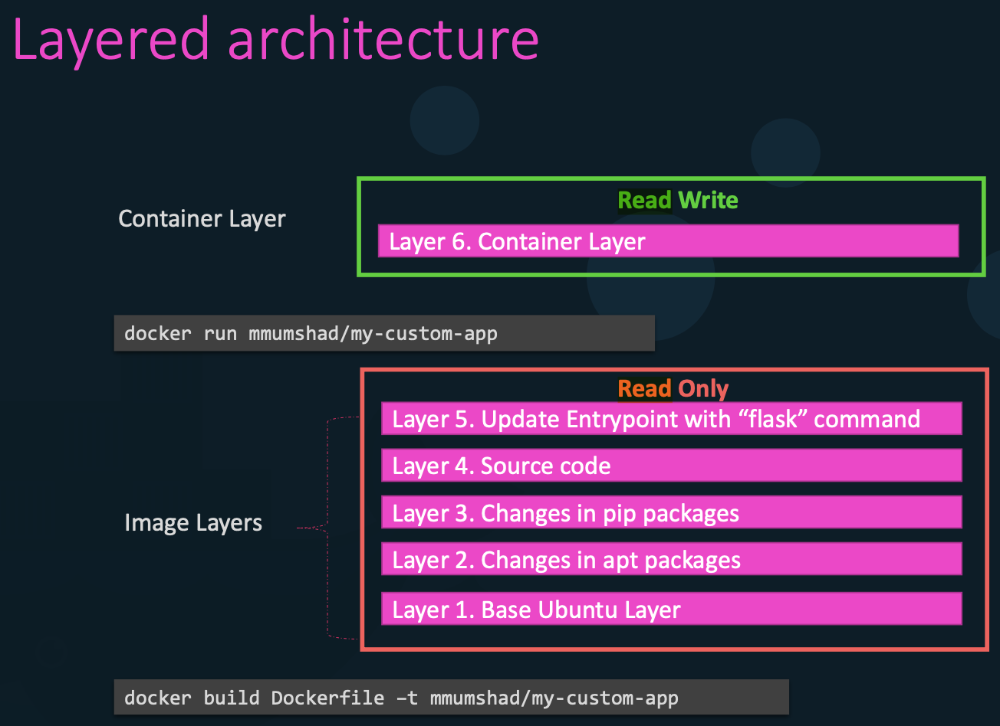
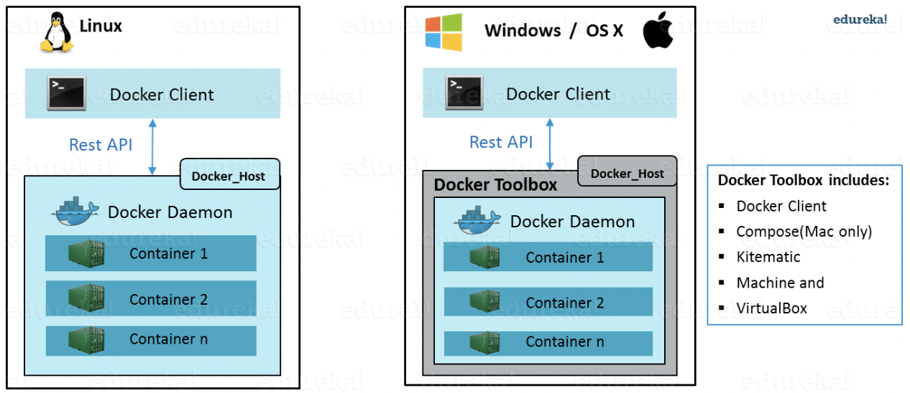

# Docker

## What is Docker?

- Docker is a **containerization** tool.
- It is used to create, run and deploy applications in containers that are isolated from the underlying hardware.

## Why do you need Docker?

- Eliminate environment-specific bugs / compatibility issues
- Promotes the reusability of components. E.g., one instance of Node.js can be used by different containers to run different services.
- Docker allows developers to share Docker images and files across machines. This enhances CI/CD. Thus, making the application development and testing faster, with a more rapid deployment.

## What is a Docker container?

- A Docker container can:
  - host a web server / application server / database
  - perform a computation or analysis task
- A container lives as long as the process is alive. E.g., If a web service inside the container has crashed, then the container exits.

## What is a Docker Image?

- An **immutable** file that contains a **set of instructions** e.g., source code, libraries, dependencies, environment variables, tools, and other config files needed to build a Docker container.
- A container is just a running instance of the image. Once a container is created, a **writable** layer is added on top of the unchangeable image, allowing a user to make changes.

## What is a Docker Registry?

- It is where the Docker Images are stored.
- It can be either a user's local repository or a public repository e.g., Docker Hub.

## Docker for Windows / Mac

A Linux VM is created, and Docker runs on it as there are no Mac / Windows based images or containers.

## Relation Between Docker and Kubernetes

- Kubernetes use Docker Hosts to host applications in the form of Docker containers.
