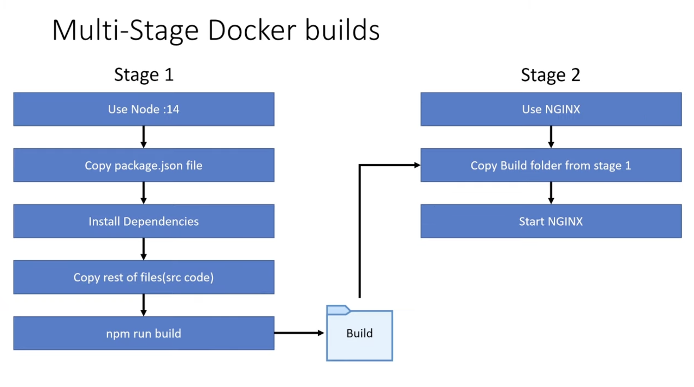

## Docker Compose

- `docker-compose.yml` - contains common config between e.g., dev and prod
- `docker-compose-dev.yml` - contains config for dev only
- `docker-compose-prod.yml` - contains config for prod only

### Run

```
docker-compose -f docker-compose.yml -f docker-compose-dev.yml up -d --build
```

- `-f` - specify filename
- `-f docker-compose.yml -f docker-compose-dev.yml` - merge and overwrite config from `docker-compose-dev.yml`
- `-d` - run in detached mode (in background)
- `--build` - to build / rebuild image

### Stop

```
docker-compose -f docker-compose.yml -f docker-compose-dev.yml down
```

# References

- https://www.youtube.com/watch?v=3xDAU5cvi5E&ab_channel=SanjeevThiyagarajan


